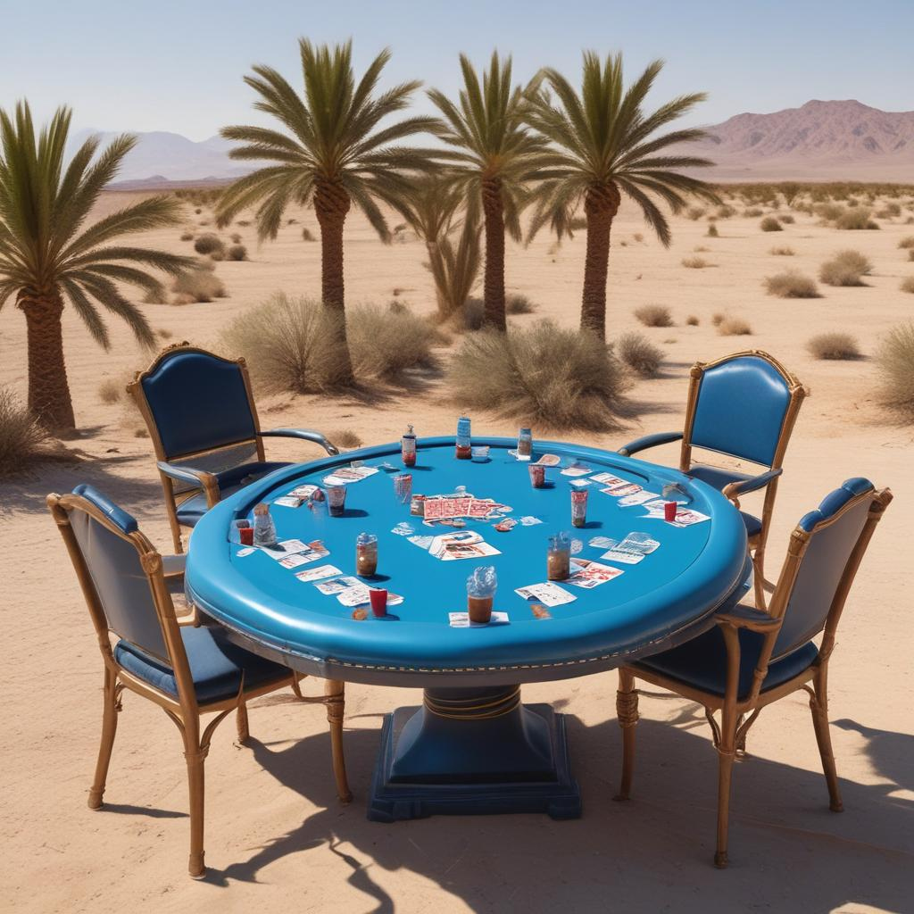

# Oasis-Poker

Exactly what you'd do in an oasis: Play poker! This is a Texas hold 'em poker shared secret state showcase with Oasis Sapphire. It allows shuffling a deck of cards confidentially in order to distribute secret hand cards to players that can then be used do determine the game winner.

https://github.com/halo3mic/oasis-poker

## Prerequisites

- Oasis Sapphire
- TypeScript

## Setup

- `yarn`

## Deployment and Testing

- `PRIVATE_KEY="0x..." npx hardhat run scripts/run-game.ts --network sapphire-testnet`

## Full Game Flow

### Setup (WIP)

1. Init a table with parameters: `smallBlind, bigBlind`
2. Users Alice, Bob and Charlie join the table (FIFO ordering, indices `0, 1, 2`)
3. Select `firstDealer` as initial value for index `d` randomly (Sapphire-shared RNG seed), e.g. as Bob=`1`
4. Table collects `smallBlind` from user `d+1` (Charlie) and `bigBlind` from user `d+2` (Alice), each `mod numberOfPlayers`
5. Table hands out two random cards to each of the three players

### Each round (flop, turn, river)

1. For `i` in `0..numberOfPlayers`, Player `d+3+i`(or `d+1+i` if flop)` mod numberOfPlayers`  is requried to make one of these choices (unless player has folded):
   1. Fold
   2. Raise by `r` (if enough cash available)
   3. Check (if allowed)
2. If only one player is left (has not folded), they win
3. If there is a raise, a new choice-sub-round of length `numberOfPlayers` is started and executed starting from (1)
4. Table reveals next card(s): 3 if flop, 1 otherwise
5. If river, identify winning player

### Win resolution

1. Transfer pot amount to winning player
2. Dissolve table

# TODOs

- [ ] Support remainder of full game flow
- [ ] Support splitpots
- [ ] Support rules for raise amounts
